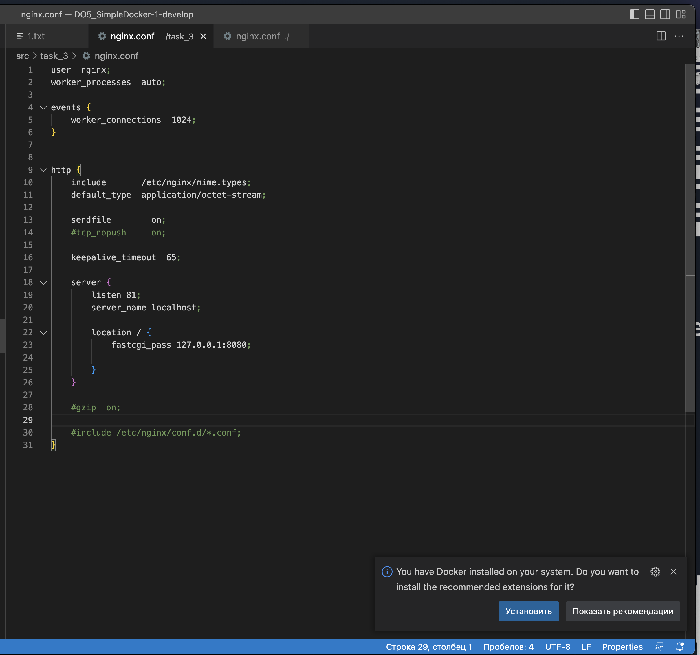

# Simple Docker

## Part 1. Готовый докер


- Проверь наличие докер-образа через docker images.


- Запусти докер-образ через docker run -d [image_id|repository]
- Проверь, что образ запустился через docker ps.


- Посмотри информацию о контейнере через docker inspect [container_id|container_name] fervent_williamson
- По выводу команды определи и помести в отчёт размер контейнера, список замапленных портов и ip контейнера.


- Размер в байтах
Элемент "ShmSize": 67108864 в выводе docker inspect относится к размеру разделяемой памяти (shared memory) в байтах, которая выделяется для контейнера. 
это не общий размер контейнера. Параметр "ShmSize" относится исключительно к размеру разделяемой памяти (SHM, или shared memory), которая используется для межпроцессного взаимодействия внутри контейнера. Общий размер контейнера включает в себя все файлы, используемые контейнером, включая его образ, слои файловой системы, которые были добавлены или изменены, а также данные в томах, если они есть.

Для получения информации о размере используемого дискового пространства контейнера можно использовать другие команды Docker, например docker ps --size, которая покажет размеры запущенных контейнеров, или docker system df, которая предоставит обзор использования дискового пространства для контейнеров, образов, томов и кэша сборки.


- Порты


- IP


- Останови докер образ через docker stop [container_id|container_name]. Проверь, что образ остановился через docker ps.


- Запусти докер с портами 80 и 443 в контейнере, замапленными на такие же порты на локальной машине, через команду run.

- Проверь, что в браузере по адресу localhost:80 доступна стартовая страница nginx.

- Перезапусти докер контейнер через docker restart [container_id|container_name].


## Part 2. Операции с контейнером

- Прочитай конфигурационный файл nginx.conf внутри докер контейнера через команду exec.


- Создай на локальной машине файл nginx.conf.

- Настрой в нем по пути /status отдачу страницы статуса сервера nginx.
Пришлось заккоментировать #include /etc/nginx/conf.d/*.conf; В директории /etc/nginx/conf.d/ обычно хранятся дополнительные конфигурационные файлы для Nginx. Если вы комментируете эту строку, Nginx перестаёт учитывать конфигурации из этих файлов. Возможно, в одном из файлов в этой директории содержится конфигурация, которая конфликтует с нашими настройками или переопределяет их, в том числе и настройку для обработки пути /status.


- Скопируй созданный файл nginx.conf внутрь докер-образа через команду docker cp.

- Перезапусти nginx внутри докер-образа через команду exec.


- Проверь, что по адресу localhost:80/status отдается страничка со статусом сервера nginx.


- Экспортируй контейнер в файл container.tar через команду export.


- Останови контейнер.

- Удали образ через docker rmi [image_id|repository], не удаляя перед этим контейнеры.

- Удали остановленный контейнер.

- Импортируй контейнер обратно через команду import.

- Запусти импортированный контейнер.


Команда nginx -g 'daemon off;' используется для запуска Nginx в фореграунде (на переднем плане), а не как демон. Рассмотрим подробнее эти компоненты:
Что означает nginx -g 'daemon off;'?
nginx - это вызов исполняемого файла Nginx, запускающего веб-сервер.
-g - это опция командной строки Nginx, которая позволяет задать глобальные директивы конфигурации прямо из командной строки. Это полезно для временных изменений или для запуска с определёнными параметрами без редактирования файлов конфигурации.
'daemon off;' - это глобальная директива для Nginx, указывающая серверу запускаться и оставаться активным на переднем плане. В обычной ситуации Nginx запускается как демон - это значит, что он отделяется от терминала и работает в фоне. Указание daemon off; заставляет его работать в фореграунде, что является требованием при запуске в Docker, так как Docker должен иметь прямой контроль над процессом.


## Part 3. Мини веб-сервер

- Установка нового образа nginx и его запуск на 81 порту 

- Напиши мини-сервер на C и FastCgi, который будет возвращать простейшую страничку с надписью Hello World!.


- Компиляция СИ файла с сервером


- Запусти написанный мини-сервер через spawn-fcgi на порту 8080.


- Напиши свой nginx.conf, который будет проксировать все запросы с 81 порта на 127.0.0.1:8080.


- Проверь, что в браузере по localhost:81 отдается написанная тобой страничка.


- Браузер отдает нашу страницу с "Hello,World!"


## Part 4. Свой докер

- Напиши свой докер-образ, который:

1) собирает исходники мини сервера на FastCgi из Части 3;

2) запускает его на 8080 порту;

3) копирует внутрь образа написанный ./nginx/nginx.conf;

4) запускает nginx.

- Напишем свой Dockerfile


- Напишем скрипт для компиляции СИ файла с сервером и его запуском
```
#!/bin/bash

gcc -o hello.fcgi main.c -lfcgi
spawn-fcgi -p 8080 ./hello.fcgi
service nginx start
nginx -s reload
/bin/bash
```
- Создадим свой образ при помощи команды docker build -t agathaze:1.0 .


- Проверим что образ появился


- Запустим образ и проверим что он отображает страницу 


- Остановим контейнер, после чего изменим nginx.conf  и перезапустим контейнер 

- Проверим что страничка отдает /status

## Part 5. Dockle

- Просканируем образ с помощь dockle


- Исправим ошибки,для этого перепишим Dockerfile


- Результат dockle 


## Part 6. Базовый Docker Compose

- Изменим файл nginx.conf, добавив туда проксирование


- Напишем docker-compose


- С помощью docker-compose build соберем 
- С помощью docker-compose up поднимим два сервера 


- Проверим что сервер успешно запустился и страничка /status отображается


